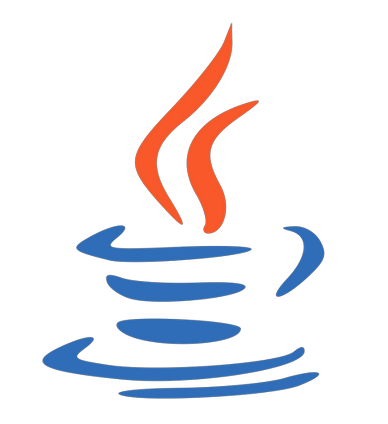

<h3 align="center">

  
  Welcome to Ajay Surya's profile!
  
</h3>

---

 ### 🧐 More About Me:

  👀 I am an Artificial Intelligence and Data Science enthusiast 
  🤖 Currently practising Machine Learning and its applications 
  🫂 Looking for a collaborator on DS and ML projects  
  📖 I'm finding opportunities for research internships in Machine Learning 

<h2> What I'm up to: </h2>

<h3 align="center">Data Science | Machine Learning | Image Processing</h3>

## 👩‍💻 Tech Stack
### Languages and tools I work with

 

### Python libraries I expertise in

